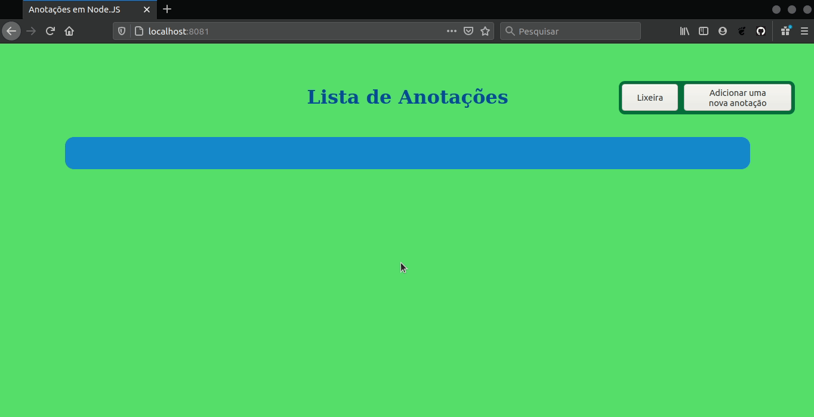

# Projeto de Postagens de Anotações
Projeto de criação de um app para postagem de anotações utilizando Node.JS e Express.

***

<br/>

## CRUD do app

<br/>

### Criação de uma anotação (Create) 


<br/>

### Visualização das anotações (Read) 


<br/>

### Atualização de uma anotação (Update) 


<br/>

### Exclusão de uma anotação (Delete) 


<br/>
<br/>

***

### Restauração de uma anotação (Restore) 


***

<br/>
<br/>

## Requesitos para rodar o app

* Node
* MySQL

<br/>

## Configuração
1. Após clonar o repositório, entre na raiz do projeto e executo o seguinte comando no terminal:
```
npm install
```

<br/>

2. Crie um banco de dados MySQL e então na raiz do projeto procure a pasta ```models``` e dentro dela o arquivo ```db.js```. Nele você deve configurar as informações necessárias para estabelecer a conexão com o banco de dados, e essas são: nome do banco de dados, nome de usuário (por padrão o usuário root) e senha de usuário. <br/> Também é possível definir o fuso hórario através do ```dialectOptions```, por padrão está configurado como Horário Padrão de Brasília (GTM-3).

```
const sequelize = new Sequelize('NomeDoBancoDeDados', 'root', 'SenhaDeUsario', {
    host: 'localhost',
    dialect: 'mysql',
    dialectOptions: {
        useUTC: false //for reading from database
    },
    timezone: '-03:00'
})
```

<br/>

3. Também na pasta `models` abra o arquivo `Post.js` e descomente a linha abaixo e execute o comando `node Post.js`:
```
//Post.sync({force: true})
```
