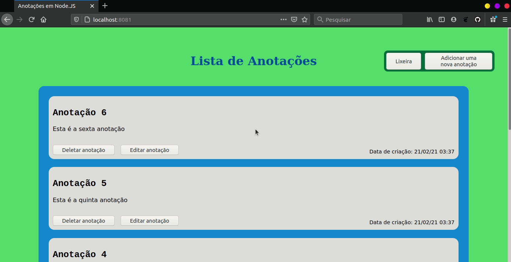

# Projeto de Postagens de Anotações
Projeto de criação de um app para postagem de anotações utilizando Node.JS e Express.

***

 

## CRUD do app

 

### Criação de uma anotação (Create) 

 

### Visualização das anotações (Read) 

 

### Atualização de uma anotação (Update) 

 

### Exclusão de uma anotação (Delete) 

 

### Restauração de uma anotação (Restore) 
